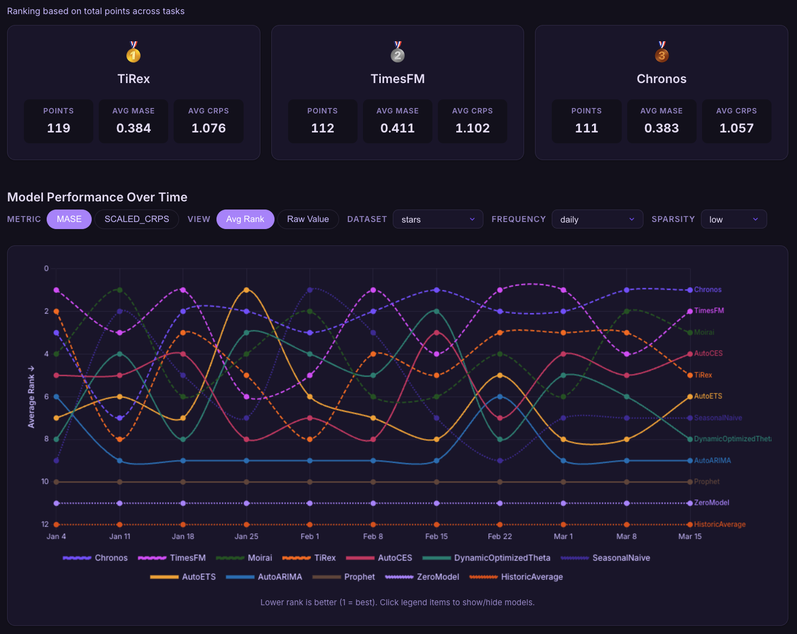

<div align="center">
  
  
</div>

<div align="center">
  <em>Live Benchmark for Temporal Generalization in Time Series Forecasting</em>
</div>

<div align="center">  
  <p>
    <a href="https://github.com/TimeCopilot/impermanent/actions/workflows/ci.yaml">
      
    </a>
    <a href="https://github.com/TimeCopilot/impermanent/blob/main/LICENSE">
      
    </a>
    <a href="https://impermanent.timecopilot.dev/">
      
    </a>
    <a href="https://arxiv.org/abs/2603.08707">
      
    </a>
    
    <a href="https://discord.gg/7GEdHR6Pfg">
      
    </a>
  </p>
</div>


---

Most forecasting benchmarks rely on static train and test splits. They measure performance on a fixed snapshot of the past.

But forecasting is not static. Data shifts. New patterns emerge. Structural breaks happen.

As foundation models scale, static benchmarks introduce new risks. Training data may overlap with evaluation data, model selection can be biased by repeated access to the test set, and reported performance may not reflect real deployment conditions.

Impermanent is a live forecasting benchmark that evaluates models sequentially over time. At each cutoff, models must forecast before the future is observed, and performance is measured as data arrives.

This makes temporal generalization measurable.

Not who performs best once, but who performs best over time.

In Impermanent, **evaluation is itself a time series**.

The benchmark includes foundation models (from AWS, Google, NXAI, Salesforce), classical statistical methods, and simple baselines. Metrics such as MASE and scaled CRPS, along with championship style points, are published on the live site.

Developed with 💙 by the Impermanent contributors. 

---

## 📰 News

- **Mar 2026**
  - Accepted at the *ICLR Workshop on Time Series in the Age of Large Models (TSALM)* 🇧🇷  
  - Paper available on [arXiv](https://arxiv.org/abs/2603.08707)  
  - Live leaderboard released at [impermanent.timecopilot.dev](https://impermanent.timecopilot.dev/)  

---

## ⚡ What you can do

- 📊 Benchmark forecasting models under real world temporal drift  
- 🔁 Track model performance over time instead of a single evaluation  
- 🧪 Compare foundation models, statistical methods, and baselines under the same pipeline  
- 📈 Analyze robustness across sparsity levels and frequencies  

---

## 🏆 Live leaderboard

[impermanent.timecopilot.dev](https://impermanent.timecopilot.dev/).

Interactive rankings, per week performance, and filters by dataset, frequency, and sparsity.

<p align="center">
  <a href="https://impermanent.timecopilot.dev/">
    
  </a>
</p>

When you compare to published numbers, cite the paper and state the last updated date shown on the site.

---

## 🚀 Add a model

We welcome contributions of new forecasting models to Impermanent.

### 1. Register your model

Add your model to `src/forecast/forecast.py` in the model registry.  
Use a unique name that will also be used in evaluation and leaderboard outputs.

### 2. Implement forecasting

Your model should return:
- point forecasts  
- quantile forecasts for probabilistic evaluation  

Ensure outputs match the expected format used in `src/evaluation/evaluate.py`.

### 3. Run locally

Validate your model before submitting. If possible, run a small end to end forecast and evaluation locally.

### 4. Open a pull request

Open a PR with:

* a short description of the model
* any relevant references or papers
* notes on runtime or hardware requirements

### 5. Evaluation and leaderboard

Once merged:

* your model will be scheduled in the evaluation pipeline
* results will appear on the live leaderboard as new cutoffs are evaluated

### 📌 Example

See [this example]() PR adding a model.

---

## 📦 What’s in the benchmark

- **Signals** Daily, weekly, and monthly series derived from [GitHub Archive](https://www.gharchive.org/) for benchmark repositories. Includes metrics such as `stars`, `pushes`, `prs_opened`, and `issues_opened`.
- **Sparsity** Series are grouped into low, medium, and high sparsity within each signal type.
- **Models** Foundation models such as Chronos, TimesFM, Moirai, and TiRex, statistical methods such as ARIMA, ETS, and Prophet, machine learning approaches, and simple baselines.
- **Updates** The pipeline runs on a schedule and the site reflects the latest aggregated evaluation artifacts.

---

## 📁 Repository layout

| Path | Role |
|------|------|
| `src/data/gh_archive/` | Data extraction, transformation, aggregation |
| `src/forecast/gh_archive/` | Forecast generation |
| `src/evaluation/gh_archive/` | Metrics and leaderboard aggregation |
| `.github/workflows/` | CI and pipeline jobs |

Processed data and evaluations live under the `impermanent-benchmark` bucket.

---

## 🛠️ Development setup

Use Python 3.11 and [uv](https://docs.astral.sh/uv/).

Install uv

```bash
curl -LsSf https://astral.sh/uv/install.sh | sh
````

Project setup

```bash
uv sync --all-groups
uv run pre-commit install
```

Production runs use Modal and AWS. Do not commit credentials.

---

## 📖 How to cite

```bibtex
@misc{garza2026impermanentlivebenchmarktemporal,
      title={Impermanent: A Live Benchmark for Temporal Generalization in Time Series Forecasting},
      author={Azul Garza and Renée Rosillo and Rodrigo Mendoza-Smith and David Salinas and Andrew Robert Williams and Arjun Ashok and Mononito Goswami and José Martín Juárez},
      year={2026},
      eprint={2603.08707},
      archivePrefix={arXiv},
      primaryClass={cs.LG},
      url={https://arxiv.org/abs/2603.08707},
}
```

---

## 🤝 Contributing

We welcome bug reports, documentation improvements, and small fixes.

### Adding a forecast model

Refere to the [Add a model](## 🚀 Add a model) section.

### Adding a dataset

Open a draft PR with scope, source, and licensing considerations, or reach out before large changes.

---

## 🔁 Reproducibility

Leaderboard tables are built from pipeline artifacts. The site reflects the latest cutoff per view. When reporting results, cite the paper and the on site date.
